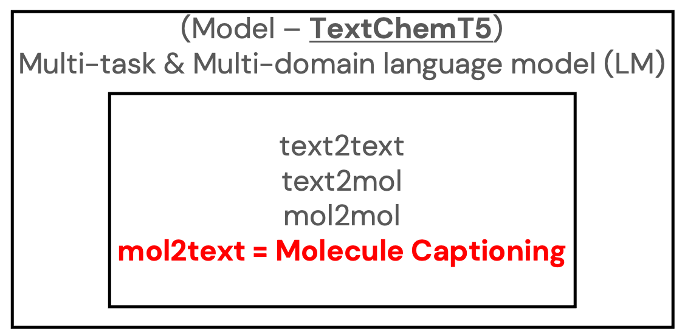
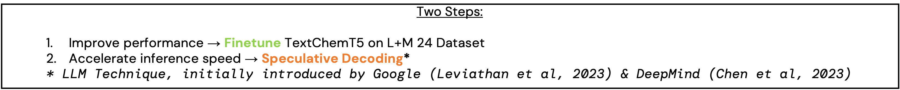
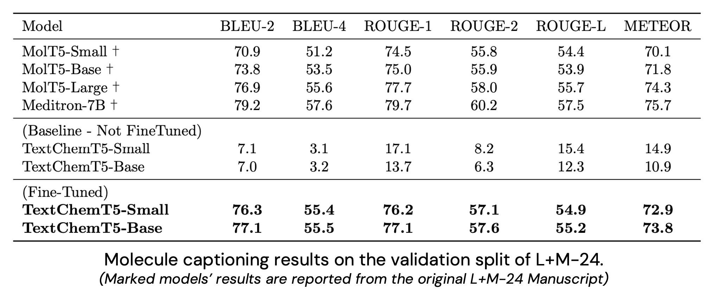
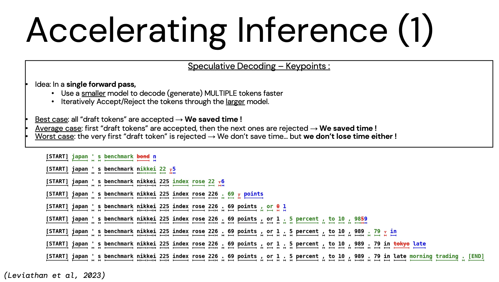
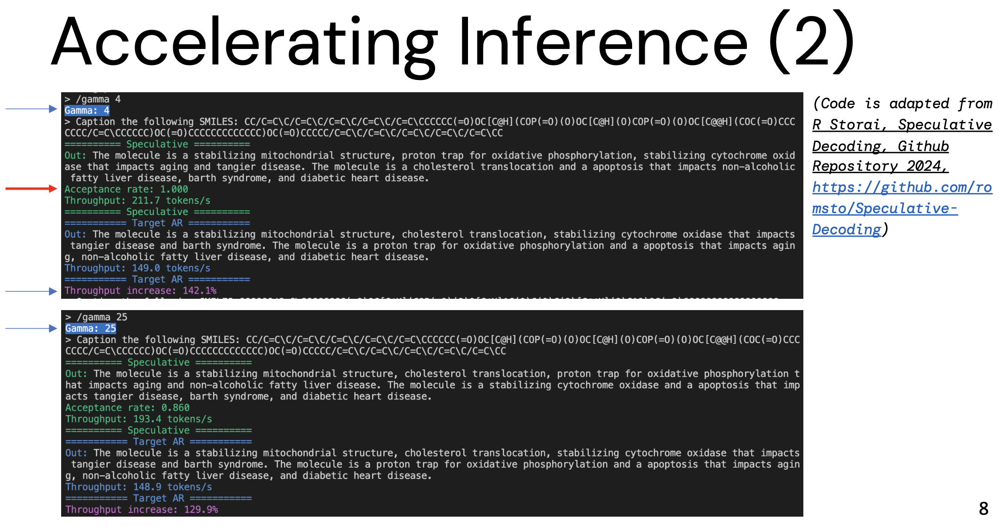
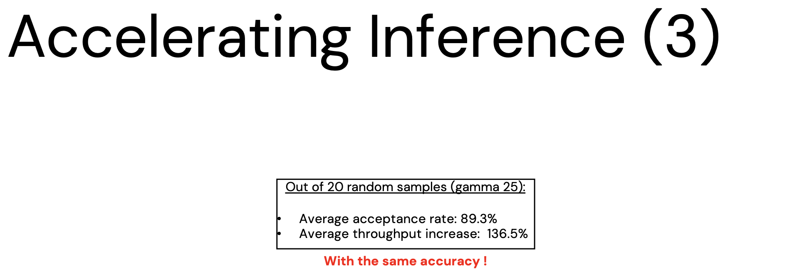

# FasText-ChemT5
This project tackles the Molecule Captioning task, using a T5 model as a backbone.
Though the original T5 model () was initially designed to handle transfer learning and multiple downstream tasks, we use Text+ChemT5 () as our backbone, and only focus on ONE task: Molecule Captioning (or "mol2text").

<em>Figure 1.</em> Original Text+ChemT5 downstream tasks.

---
Our main objective is to make molecule captioning **efficient and accurate**. We proceed in two steps described below:

<em>Figure 2.</em> Goals of this project.

For the first step, we use the L+M-24 dataset () to fine-tune our models.

For the second step, "Speculative Decoding" is a whole topic by itself... Conceptually, the idea is to spend more resources on decoding "harder" tokens.
In this project, we adapt the implementation of Romain Storaï ()!

---

You can finetune your own models (no need to explain how, it's really just downloading the original dataset and fine-tuning the T5 model from the transformers library) but we provide checkpoints just for evaluation reproducibility.

You can then have fun playing with the Speculative Decoding (by installing the requirements and running `Speculative\ Decoding/infer.py` in the CLI).

# Results

The first objective, being improving overall captioning quality, is fullfilled:

<em>Figure 3.</em> Results for performance metrics after fine-tuning the Small and Base models.

For the second objective, inference speed, it's a bit hard to cover it all so here are three slides to explain what Speculative Decoding is, examples in our project and key results:

(For reference, the figure examplifying Speculative Decoding comes from the original manuscript: ).